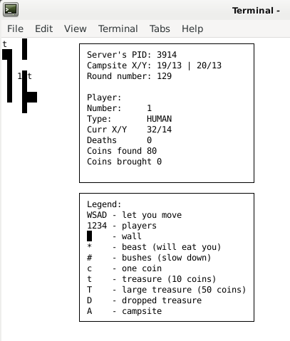

# Multi threaded maze game for 4 players using IPC
One of the projects to pass the course operating systems
###### it took around 36h in 6 days to be completed
In this part of operating systems I had to use and learn threads, semaphores, shared memory and signals in linux
### How to run this game?
Firstly we have to compile server.c (g++ -lrt -lpthread -lcurses -lm server.c) 
then run compiled *.out file 
Secondly we have to compile player.c (g++ -lrt -lpthread -lcurses -lm player.c) 
then run compiled *.out file(this part we can repeat 4 times, each repetition will add another player) 
### About the game
It's simply maze game where players have to collect coins('c' on the map) and treasures('t' and 'T' on the map)
 Bring treasures to campsites('A' on the map) and compete with other players 
Of course, where there is a treasure, there is also a beast ("*" on the map) to protect it

From the server view you can simply add some beasts by pressing 'b'(the maximum amount of the beast is 5) on your keyboard or add more treasures and coins by pressing 'c', 't', 'T'(the maximum amount of the treasures at one time is 40) on keyboard, to quit you have to press 'q'

From the player view you can only move by using 'wsad' and quit the game by presing 'q'

#### Some screens from game
##### Server window

##### Player window
